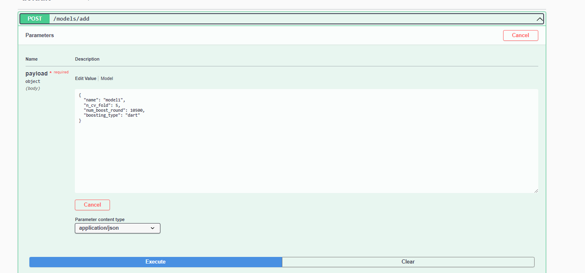
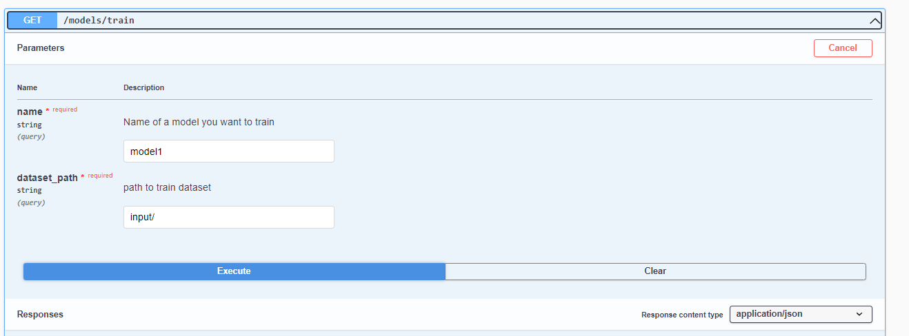
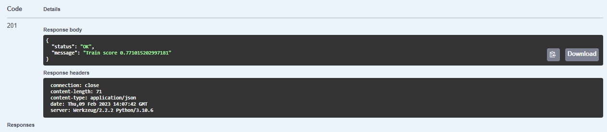
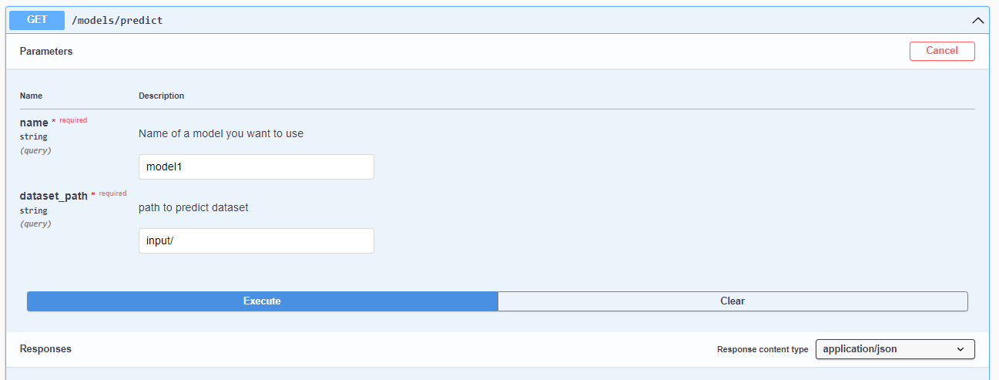
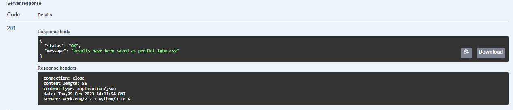
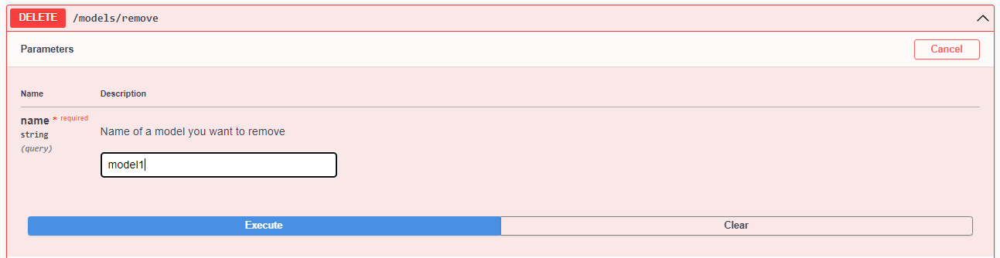
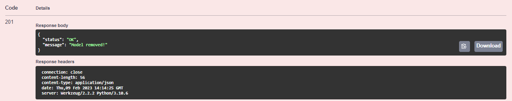

# Сервис для предсказания дефолта по финансовым показателям клиента

Сервис поддерживает управлением классификационными моделями для предсказания дефолта по финансовых показателям клиента. В качестве датасета используется датасет соревнования , а в качестве модели и признаков -- одно из самых лучших решений данного соревнования.  Сервис дает возможность добавлять модели с заданными параметрами, а также обучать их, тестировать и сохранять. Взаимодействие с HTTP сервисом реализовано с помощью API REST:

* `POST /models/add`: Добавляет новую модель с указанного типа.

* `GET /models/list`: Возвращает информацию о запущенных моделях, их имена и соответствующий статус (обучена/необучена) с метриками на обучающей и тестовой выборке.

* `GET /models/train`: Запускает обучение модели, с указанными именем на указанном датасете. Фиксирует метрику качества модели на данном датасете и сохраняет значение.

* `POST /models/predict`: Запускает предсказание модели на указанных данных.

* `DELETE /models/remove`: Удаляет модель, с указанными именем.

Каждый метод имеет документацию, описывающую правила ввода входных данных и список возможных кодов ответа метода.

## Запуск HTTP сервиса:

1. `poetry install` - устанавливаем зависимости
 
2. `poetry run python app.py` - запускаем приложение

3. перейти по предложенной ссылке сервиса: http://127.0.0.1:5000

## Датасет

Мы используем датасет соревнования ю Цель данного соревнования является построение лучшей модели прогнозирование вероятности того, что клиент не выплатит сумму остатка по кредитной карте в будущем (дефолт), на основе его ежемесячного профиля клиента. Целевая бинарная переменная рассчитывается путем наблюдения за 18-месячным окном транзакций после последней выписки по кредитной карте, и если клиент не выплачивает необходимую сумму в течение 120 дней после даты последней выписки, это считается дефолтом.

Набор данных содержит агрегированные характеристики профиля для каждого клиента на каждую дату выписки. Признаки анонимизированы и нормализованы и делятся на следующие общие категории:

D_* = Переменные просроченных выплат.
S_* = Переменные трат.
P_* = Переменные выплат.
B_* = Переменные баланса.
R_* = Переменные рисков.

Кроме того, каждый клиент имеет уникальный идентификатор `customer_ID` и метку наличия дефолта `target`.

# Сервис для предсказания стоимости медицинского страхования

Сервис поддерживает управлением регрессиоными моделями для предсказания стоимости медицинской страховки по ряду признаков. Сервис дает возможность добавлять модели с заданными параметрами, а также обучать их, тестировать и сохранять. Взаимодействие с HTTP сервисом реализовано с помощью API REST:

* `POST /models/add`: Добавляет новую модель указанного типа с указанными гиперпараметрами.

* `GET /models/list`: Возвращает информацию о запущенных моделях, их имена и соответствующий статус (обучена/необучена) с метриками на обучающей и теститовой выборке.

* `GET /models/train`: Запускает обучение модели, с указанными именем на указанном датасете. Фиксирует метрику качества модели на данном датасете и сохраняет значение.

* `POST /models/predict`: Запускает предсказание модели на указанных данных.

* `DELETE /models/remove`: Удаляет модель, с указанными именем.

Каждый метод имеет документацию, описывающую правила ввода входных данных и список возможных кодов ответа метода.

## Пример

Добавление модели с указанными имени и гиперпараметрами:

Обучение ранее добавленной моедли:

После обучения получаем сообщение:

Предсказание на модели, которую добавили ранее с помощью `POST /models/add` и обучили с помощью `GET /models/train`

Получаем следующий ответ:

Наконец, мы можем удалить модель:

Получили сообщение:

